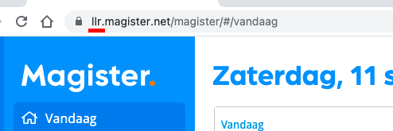

## Config Variables

* `googleApis`
    * [`googleApis.calendarId`](#googleapiscalendarid-string)
    * [`googleApis.timeZone`](#googleapistimezone-string)
    * [`googleApis.scopes`](##googleapisscopes-arraystring)
* `appointments`
    * `appointments.defaults`
        * [`appointments.defaults.location`](#appointmentsdefaultslocation-string)
        * [`appointments.defaults.description`](#appointmentsdefaultsdescription-string)
    * [`appointments.reminders`](#appointmentsreminders-object)
    * [`appointments.filter`](#appointmentsfilter-function)
    * [`appointments.summary`](#appointmentssummary-function)
    * [`appointments.color`](#appointmentscolor-function)
* `magister`
    * [`magister.schoolId`](#magisterschoolid-string)
    * [`magister.userId`](#magisteruserid-number--string)
    * [`magister.password`](#magisterpassword-string)


The config variables are located at `config/config.js`:

```js
module.exports = {
    googleApis: {
        calendarId: String,
        timeZone: String,
        scopes: Array[String]
    },
    appointments: {
        defaults: {
            location: String,
            description: String,
        },
        reminders: Object,
        filter: Function,
        summary: Function,
        color: Function
    },
    magister: {
        schoolId: String,
        userId: Number || String,
        password: String
    }
};
```

#### googleApis.calendarId `String`

The calendar ID to store all the appointments. Use the keyword `primary` for the main calendar.

#### googleApis.timeZone `String`

A timezone from the TZ database. See [List of tz database time zones - Wikipedia](https://en.wikipedia.org/wiki/List_of_tz_database_time_zones) for more info

#### googleApis.scopes `Array[String]`

Google OAuth scopes:

```js
[
    'https://www.googleapis.com/auth/userinfo.profile',
    'https://www.googleapis.com/auth/user.emails.read',
    'https://www.googleapis.com/auth/calendar',
    'https://www.googleapis.com/auth/calendar.events'
]
```

#### appointments.defaults.location `String`

Default location if none is provided by Magister.

#### appointments.defaults.description `String`

Default description. Supports HTML.

#### appointments.reminders `Object`

Google calendar default reminders.

#### appointments.filter `Function`

Include or disinclude appointments in Google Calendar.

```js
filter(magisterAppointment: Object): Boolean
```

Example:

```js
// Only include appointments if they don't contain 'foo' in the summary.
filter: function($) {
    return $.Omschrijving.indexOf('foo') != -1;
}
```

[`magisterAppointment`](Magister-Appointment-Object.md) object

#### appointments.summary `Function`

Generate a summary based on the Magister appointment.

```js
summary(magisterAppointment: Object): String
```

Example:

```js
// Return the lesson hour and the subject name, but only if it is a
// lesson. Else, return the default summary.
summary: function($) {
    if ($.Vakken.length) return `${$.LesuurVan}. ${$.Vakken[0].Naam}`;
    else return $.Omschrijving;
}
```

[`magisterAppointment`](Magister-Appointment-Object.md) object

#### appointments.color `Function`

Generate a Google Calendar color based on the Magister appointment.

```js
color(magisterAppointment: Object): Number || String
```

Example:

```js
// If the appointment is a lesson, make it blue, otherwise make it grey
color: function($) {
    if ($.Vakken.length) return 7; // ColorID for blue
    else return 8; // ColorID for grey
}
```

[`magisterAppointment`](Magister-Appointment-Object.md) object

#### magister.schoolId `String`

A 3 letter long id corresponding to your school. Can be found in the domain name of magister:



_In the case above, `llr` is the school ID_

#### magister.userId `Number || String`

Your login username/user id.

#### magister.password `String`

Your password matching your user ID.

---

You are now done 🎉   —  [Back to readme](README.md)
