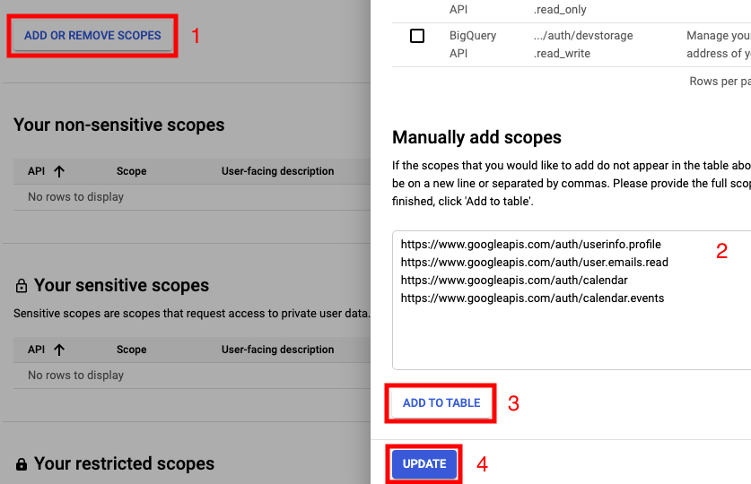
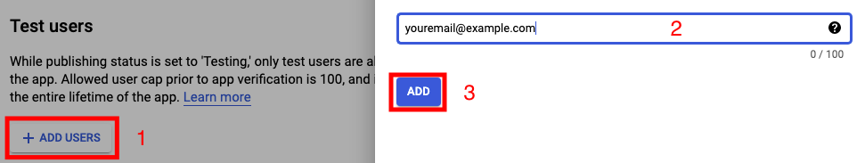
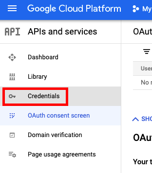
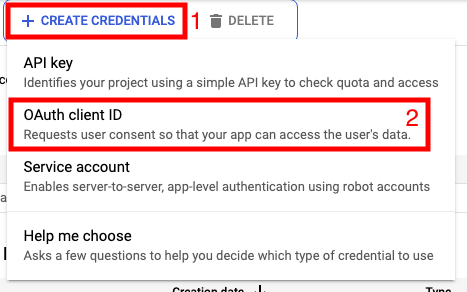
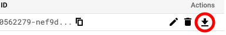

## Create OAuth application

### Steps

* [Step 1](#1-go-to-the-google-cloud-platform-and-create-a-new-project-give-it-a-name-and-click-create-and-select-your-project): Create a new project
* [Setp 2](#2-enable-these-apis): Enable APIs
* [Step 3](#3-on-the-oauth-consent-screen-select-internal-and-click-create): Create an OAuth app
* [Step 4](#4-in-the-scopes-tab-click-add-or-remove-scopes-in-manually-add-scopes-and-type-the-following): Add scopes
* [Step 5](#5-in-the-test-users-tab-click-add-users-add-your-own-email): Add test users
* [Step 6](#6-click-credentials-on-the-side-bar), [Step 7](#7-click-create-credentials--oauth-client-id-and-select-desktop-app), and [Step 8](#8-select-the-download-button): Create a credentials file

#### 1. Go to the [Google Cloud Platform](https://console.cloud.google.com/projectcreate), and create a new project. Give it a name and click **Create** and select your project.

#### 2. Enable these APIs:

* [Google Calendar API](https://console.cloud.google.com/marketplace/product/google/calendar-json.googleapis.com?q=search)
* [Google People API](https://console.cloud.google.com/marketplace/product/google/people.googleapis.com?q=search)

#### 3. On the [OAuth Consent Screen](https://console.cloud.google.com/apis/credentials/consent), select **Internal**, and click **Create**.

Fill in your app name. In the field _User support email_, and _Developer contact information > Email Addresses_ fill in you Gmail address of the account you are setting this up with.

Click **Save and Continue**.

#### 4. In the **Scopes** tab, click **Add or Remove Scopes**. In **Manually add Scopes**, and type the following:

```
https://www.googleapis.com/auth/userinfo.profile
https://www.googleapis.com/auth/user.emails.read
https://www.googleapis.com/auth/calendar
https://www.googleapis.com/auth/calendar.events
```



Click **Save and Continue**

#### 5. In the **Test Users** tab, click **Add Users**, add your own email.



Afterwards, click **Save and Continue** and **Back to Dashboard**

#### 6. Click **Credentials** on the side bar.



#### 7. Click **Create Credentials** > **OAuth client ID** and select **Desktop app**



#### 8. Select the download button.



Save the downloaded file to `config/credentials.json`

---

You are now done 👏 &nbsp; — &nbsp;[Back to readme](README.md)
