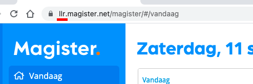

## Configuratie Variabelen

* `googleApis`
    * [`googleApis.calendarId`](#googleapiscalendarid-string)
    * [`googleApis.timeZone`](#googleapistimezone-string)
    * [`googleApis.scopes`](##googleapisscopes-arraystring)
* `appointments`
    * `appointments.defaults`
        * [`appointments.defaults.location`](#appointmentsdefaultslocation-string)
        * [`appointments.defaults.description`](#appointmentsdefaultsdescription-string)
    * [`appointments.reminders`](#appointmentsreminders-object)
    * [`appointments.filter`](#appointmentsfilter-function)
    * [`appointments.summary`](#appointmentssummary-function)
    * [`appointments.color`](#appointmentscolor-function)
* `magister`
    * [`magister.schoolId`](#magisterschoolid-string)
    * [`magister.userId`](#magisteruserid-number--string)
    * [`magister.password`](#magisterpassword-string)


De configuratie variabelen worden opgeslagen in een bestand op `config/config.js`:

```js
module.exports = {
    googleApis: {
        calendarId: String,
        timeZone: String,
        scopes: Array[String]
    },
    appointments: {
        defaults: {
            location: String,
            description: String,
        },
        reminders: Object,
        filter: Function,
        summary: Function,
        color: Function
    },
    magister: {
        schoolId: String,
        userId: Number || String,
        password: String
    }
};
```

#### googleApis.calendarId `String`

De kalender-ID om alle afspraken op te slaan. Gebruik het trefwoord `primair` voor de hoofdagenda.

#### googleApis.timeZone `String`

Een tijdzone uit de TZ-database. Bekijk [Lijst van TZ-database tijdzones - Wikipedia](https://en.wikipedia.org/wiki/List_of_tz_database_time_zones) voor meer informatie.

#### googleApis.scopes `Array[String]`

Google OAuth scopes:

```js
[
    'https://www.googleapis.com/auth/userinfo.profile',
    'https://www.googleapis.com/auth/user.emails.read',
    'https://www.googleapis.com/auth/calendar',
    'https://www.googleapis.com/auth/calendar.events'
]
```

#### appointments.defaults.location `String`

Standaardlocatie als er geen wordt verstrekt door Magister.

#### appointments.defaults.description `String`

Standaard beschrijving. Ondersteunt HTML.

#### appointments.reminders `Object`

Standaardherinneringen instellingen voor Google Agenda.

#### appointments.filter `Function`

Afspraken opnemen of uitsluiten in Google Agenda.

```js
filter(magisterAppointment: Object): Boolean
```

Example:

```js
// Neem alleen afspraken op als er geen 'foo' in de omschrijving staat.
filter: function($) {
    return $.Omschrijving.indexOf('foo') != -1;
}
```

[`magisterAppointment`](Magister-Appointment-Object.md) object

#### appointments.summary `Function`

Genereer een samenvatting op basis van de Magister-afspraak.

```js
summary(magisterAppointment: Object): String
```

Example:

```js
// Gebruik het lesuur en de naam van de afspraak, maar alleen als het een les is.
// Anders, retourneer de standaard omschrijving.
summary: function($) {
    if ($.Vakken.length) return `${$.LesuurVan}. ${$.Vakken[0].Naam}`;
    else return $.Omschrijving;
}
```

[`magisterAppointment`](Magister-Appointment-Object.md) object

#### appointments.color `Function`

Genereer een Google Agenda-kleur op basis van de Magister-afspraak.

```js
color(magisterAppointment: Object): Number || String
```

Voorbeeld:

```js
// Als de afspraak een les is, maak het blauw, anders grijs.
color: function($) {
    if ($.Vakken.length) return 7; // Kleur ID voor blauw
    else return 8; // Kleur ID voor 8
}
```

[`magisterAppointment`](Magister-Appointment-Object.md) object

#### magister.schoolId `String`

Een ID van 3 letters die overeenkomt met jouw school. Te vinden in de domeinnaam van magister:



_In het bovenstaande geval is `llr` de school-ID_

#### magister.userId `Number || String`

Uw login gebruikersnaam/gebruikers-ID.

#### magister.password `String`

Uw wachtwoord dat overeenkomt met uw gebruikers-ID.

---

Je bent nu klaar 🎉 &nbsp; — &nbsp;[Terug naar readme](README.md)
