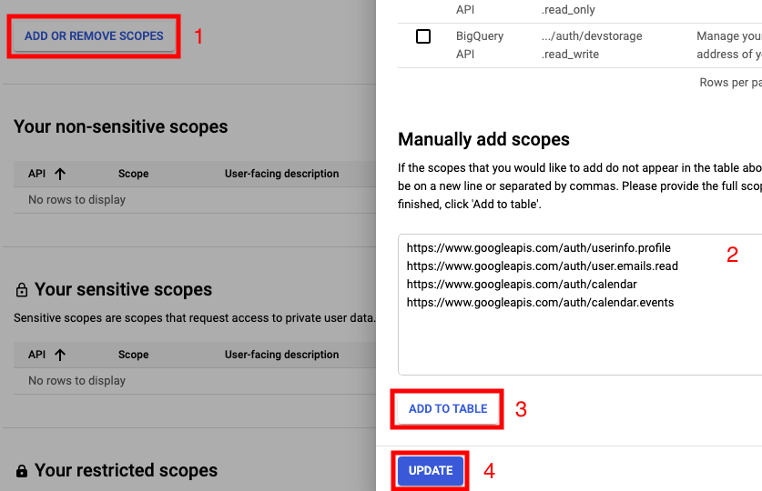
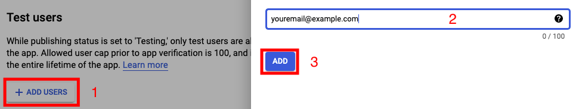
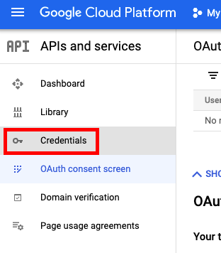
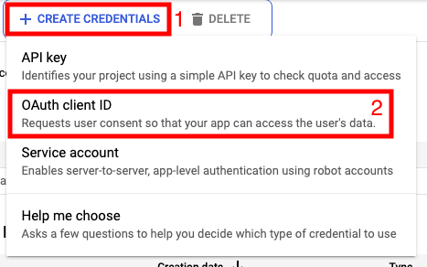
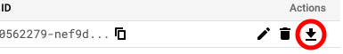

## Maak een Google OAuth Applicatie aan

### Stappen

* [Stap 1](#1-ga-naar-het-google-cloud-platform-en-maak-een-nieuw-project-aan-geef-het-een-naam-klik-op-create-en-selecter-het-nieuw-gemaakte-project): Maak een niew project
* [Stap 2](#2-schakel-de-apis-in): Schakel de goede APIs in
* [Stap 3](#3-op-het-oauth-toestemming-scherm-selecteer-internal-en-klik-op-create): Maak een OAuth app
* [Stap 4](#4-in-het-scopes-tabblad-klik-op-add-or-remove-scopes-manually-add-scopes-and-typ-het-volgende): Voeg scopes toe
* [Stap 5](#5-in-de-test-users-tabblad-klik-op-add-users-en-voeg-je-eigen-email-toe): Voeg "test" gebruikers aan
* [Stap 6](#6-klik-op-credentials-op-de-zijbalk), [Step 7](#7-klik-op-create-credentials--oauth-client-id-en-selecteer-desktop-app), and [Stap 8](#8-klik-op-de-download-knop): Maak een referenties bestand

#### 1. Ga naar het [Google Cloud Platform](https://console.cloud.google.com/projectcreate), en maak een nieuw project aan. Geef het een naam, klik op **Create** en selecter het nieuw gemaakte project.

#### 2. Schakel de APIs in:

* [Google Calendar API](https://console.cloud.google.com/marketplace/product/google/calendar-json.googleapis.com?q=search)
* [Google People API](https://console.cloud.google.com/marketplace/product/google/people.googleapis.com?q=search)

#### 3. Op het [OAuth Toestemming Scherm](https://console.cloud.google.com/apis/credentials/consent), selecteer **Internal**, en klik op **Create**

Vul de app naam in. In het veld _User support email_ en _Developer contact information > Email Addresses_ voeg jouw Gmail adres van het account waarmee je dit aan het opzetten bent in.

Klik op **Opslaan en Doorgaan**.

#### 4. In het **Scopes** tabblad, klik op **Add or Remove Scopes**, **Manually add Scopes**, and typ het volgende.

```
https://www.googleapis.com/auth/userinfo.profile
https://www.googleapis.com/auth/user.emails.read
https://www.googleapis.com/auth/calendar
https://www.googleapis.com/auth/calendar.events
```



Klik op **Save and Continue**

#### 5. In de **Test Users** tabblad, klik op **Add Users**, en voeg je eigen email toe.



Daarna, klik op **Save and Continue** en **Back to Dashboard**

#### 6. Klik op **Credentials** op de zijbalk.



#### 7. Klik op **Create Credentials** > **OAuth client ID** en selecteer **Desktop app**



#### 8. Klik op de download knop



Sla het gedownloadde bestand op in `config/credentials.json`.

Als je een service (zoals Heroku) gebruikt waar je alleen de enviroment variablen kunt instellen, kan je de
variabele `GOOGLE_CREDENTIALS` instellen op dit bestand.

---

Je bent nu klaar 👏 &nbsp; — &nbsp;[Terug naar readme](README.md)
